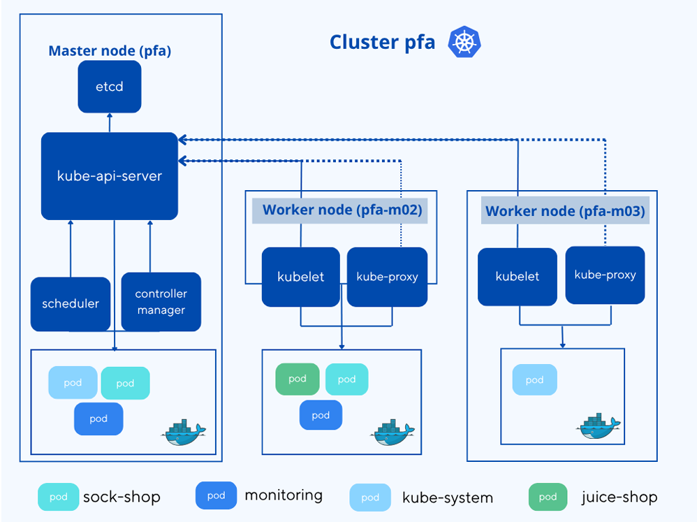
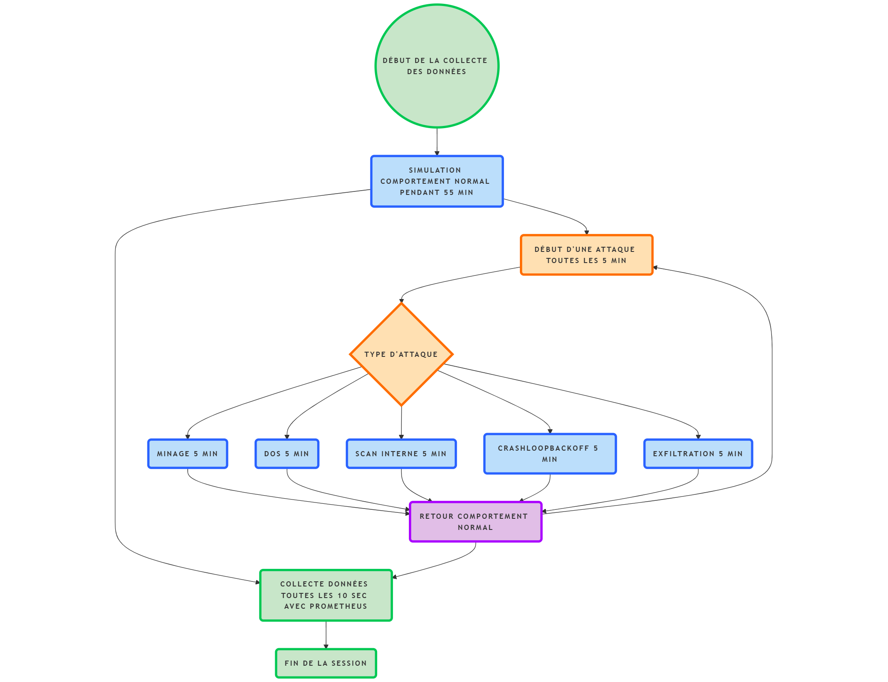

````markdown
# 🛡️ AI-Enhanced Kubernetes Security & Anomaly Detection

## 📌 Project Overview
This project aims to **reinforce security and anomaly detection in Kubernetes clusters** using **Artificial Intelligence (AI) and Machine Learning (ML)**.  
We designed and implemented a monitoring and anomaly detection system that leverages **Prometheus**,  and custom Python scripts to collect, analyze, and classify metrics from a Kubernetes cluster.  

The focus is on detecting abnormal behaviors such as **CPU, memory, or network anomalies** caused by simulated attacks, while distinguishing them from normal workloads.

---

## ⚙️ System Architecture


- **Cluster**: Kubernetes (Minikube, 3 nodes)  
- **Applications deployed**:  
  - [Sock Shop](https://github.com/ocp-power-demos/sock-shop-demo)  
  - [Juice Shop](https://github.com/l0renz02017/OWASP-Juice-Shop-Kubernetes)  
- **Monitoring stack**:  
  - Prometheus (metrics collection)   
- **Simulation tools**:  
  - `hey` (HTTP load generator)  
  -  Deplyment of abnormal pods (miner, scanner, crashy)

---

## 📊 Data Collection


- Metrics collected from **Prometheus API**:  
   - Pod restarts: 'sum(kube_pod_container_status_restarts_total)',
   - CPU usage : 'sum(rate(container_cpu_usage_seconds_total[1m]))',
   - Memory consumption: 'sum(rate(container_memory_usage_bytes[1m]))',
   - Network Transmitted bytes : 'sum(rate(container_network_transmit_bytes_total[1m]))',
   - Network received bytes : 'sum(rate(container_network_receive_bytes_total[1m]))'  
- Scenarios simulated:  
  - **Normal behavior** → realistic user interactions & traffic  
  - **Abnormal behavior** → stress tests, overload, simulated attacks  

The collected data is labeled (normal / abnormal) and prepared for ML model training.

---

## 🤖 Machine Learning Approach
- Data preprocessing and labeling  
- Model training for **anomaly detection**  
- Evaluation based on accuracy, precision, recall, and F1-score  

---

## 🚀 How to Run

### 1️⃣ Deploy the Cluster & Monitoring
```bash
minikube start --nodes=3 -p pfa
helm repo add prometheus-community https://prometheus-community.github.io/helm-charts
helm install prometheus prometheus-community/kube-prometheus-stack -n monitoring --create-namespace
````

### 2️⃣ Deploy Applications

```bash
kubectl create namespace sock-shop
kubectl create namespace juice-shop
# Apply manifests for Sock Shop and Juice Shop
```

### 3️⃣ Simulate Workloads and Collect Metrics

Run the Python script to simulate session and fetch metrics periodically:

```bash
python Session Simulation.py
```

---

## 📈 Results

* Successful collection of the chosen metrics under **normal** and **attack** scenarios
* Built a dataset to train ML models for anomaly detection
* Initial results show that AI can help improve **security monitoring in Kubernetes clusters**

---

## 👥 Team

* Project carried out by a group of 3 engineering students as part of the **end-of-year PFA project**
* Supervised at **INSAT (Institut National des Sciences Appliquées et de Technologie, Tunis)**

---

## 🔮 Future Work

* Extend to more metrics (network, disk I/O, system calls)
* Deploy advanced models (e.g., LSTM, Autoencoders)
* Integrate anomaly alerts directly into **Grafana dashboards**
* Test scalability in larger clusters

